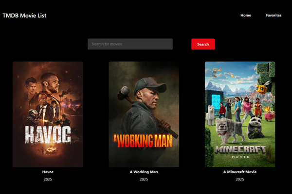

<h2 align="center"><a href="https://rerigan.github.io/tmdb-movies/">TMDB Movies</h2></a>

Esse site é um catálogo de filmes feito com a API do TMDB, mostrando os filmes mais populares do momento com uma função de busca. Feito com React @Vite. Me proporcionou melhor conhecimento sobre consumo de APIs em React, além da utilidade dos componentes, além de ter sido meu primeiro contato com localstorage.

 

## 🚀 Tecnologias

Esse projeto foi desenvolvido com as seguintes tecnologias:

- React @Vite - estilização, formatação, integração de HTML, CSS, Javascript
- JavaScript - consumo de APIs, funções de pesquisa, etc.

       

  

